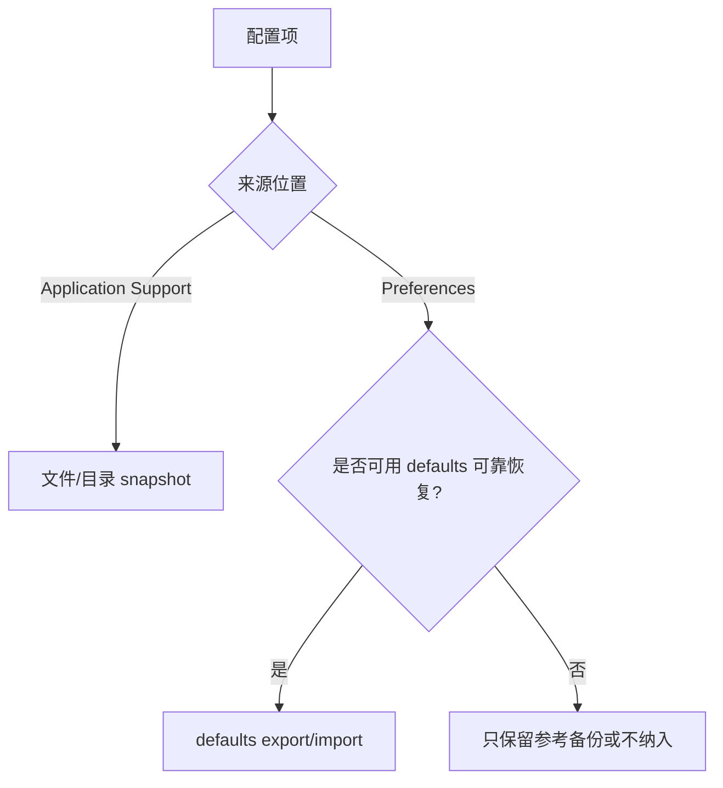
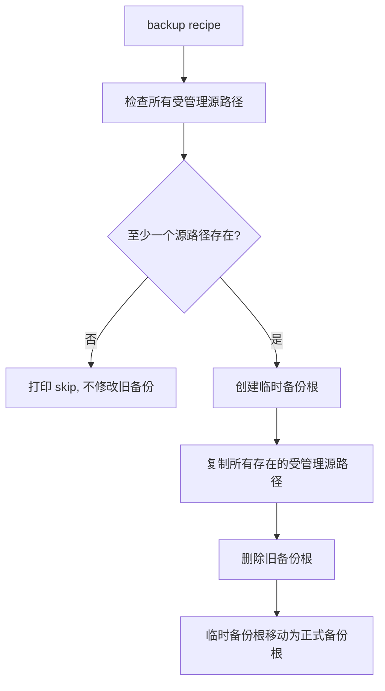
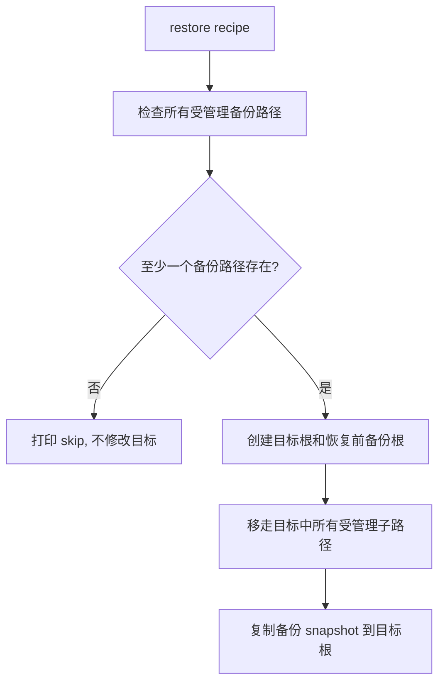
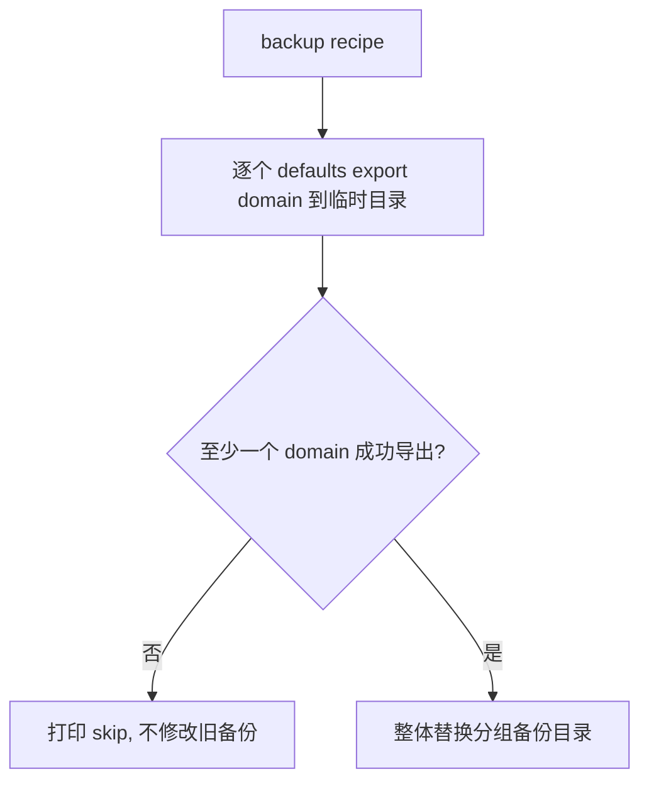
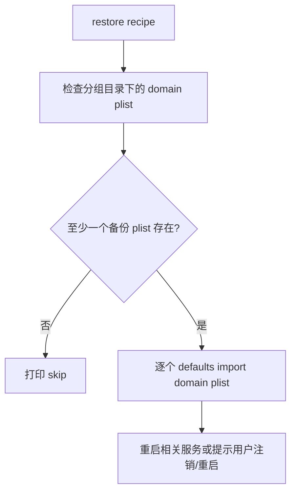
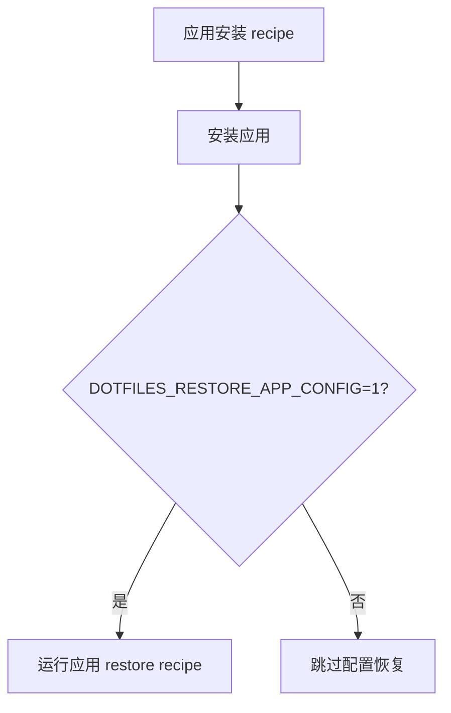

# macOS 配置备份/恢复

## 范围

管理 macOS 上少量已确认值得迁移的应用配置和偏好设置。

配置来源分两类处理：

- `~/Library/Application Support/...`：按文件或目录 snapshot 备份/恢复。
- `~/Library/Preferences/...`：按 `defaults` domain 导出/导入，不直接 `cp`
  plist 覆盖用户偏好文件。

是否纳入备份/恢复需要逐个应用或逐个 domain 确认。加入前需要明确：

- 本地配置是否值得迁移；
- 配置属于 `Application Support` 文件树，还是 `Preferences` domain；
- 需要迁移哪些文件、目录或 domain；
- restore 是否可靠，是否需要重启相关服务、注销或重启；
- 应用自身是否已有账号同步、内置导入导出等机制，使 dotfiles 迁移变得不必要。

## 备份目录结构

备份统一放在 `~/.config/backups/macos` 下，并保留 macOS 配置来源层级。

`Application Support` 使用路径镜像：

```text
~/Library/Application Support/KeePassXC/keepassxc.ini
~/.config/backups/macos/Application Support/KeePassXC/keepassxc.ini
```

`Preferences` 使用分组目录保存 `defaults export` 的结果：

```text
defaults domain: com.apple.symbolichotkeys
~/.config/backups/macos/preferences/keyboard-shortcuts/com.apple.symbolichotkeys.plist
```

分组目录是 snapshot 根。不要把多个无关 preference domain 直接平铺到
`backups/macos/preferences` 根目录，否则某个 recipe 替换 snapshot 时容易影响其他
配置。

## 机制选择



规则：

- `Application Support` 配置由 `just/app_config.sh` 管理。
- `Preferences` 配置由 preference helper 管理，底层使用
  `defaults export <domain> <file>` 和 `defaults import <domain> <file>`。
- 不直接把 `~/Library/Preferences/*.plist` 复制回原位置。
- Apple/system-managed preference 必须 case by case 确认。能读不代表能可靠恢复。
- 输入源这类由系统输入法服务管理且没有可靠 restore 路径的配置，不纳入迁移。

## Application Support recipe

每个支持迁移的应用都有独立 recipe。recipe 只声明：

- 相对于 `~/Library` 的配置根目录；
- 需要迁移的子路径列表。

这些子路径称为“受管理子路径”。同一个应用的受管理子路径共同组成一个
snapshot，backup 和 restore 都按这个 snapshot 处理，避免新旧配置混杂。

示例：

```just
system-productivity-keepassxc-backup-darwin:
    just/app_config.sh backup \
        "Application Support/KeePassXC" \
        "keepassxc.ini"

system-productivity-keepassxc-restore-darwin:
    just/app_config.sh restore \
        "Application Support/KeePassXC" \
        "keepassxc.ini"

system-productivity-keepassxc-darwin:
    brew install --cask keepassxc
    just/app_config_restore_if_enabled.sh just --justfile "{{justfile()}}" system-productivity-keepassxc-restore-darwin
```

## Application Support 备份流程



规则：

- 所有受管理源路径都不存在时，视为应用未配置或未安装；backup 正常 skip，不删除旧备份。
- 至少一个受管理源路径存在时，当前 snapshot 会整体替换旧备份根。
- 旧备份根中不再出现在当前 snapshot 里的文件会被移除，避免新旧备份混杂。
- 尽量保留文件权限和时间戳等元数据。
- 脚本需要同时支持文件和目录。

## Application Support 恢复流程



规则：

- 所有受管理备份路径都不存在时，restore 正常 skip，不修改目标配置。
- restore recipe 本身不负责安装应用。
- restore 只管理 recipe 声明的受管理子路径，不删除配置根下未声明的其他路径。
- 受管理子路径以备份 snapshot 为准；备份里不存在的受管理路径，恢复后目标中也不保留。
- 恢复前如果目标中存在受管理子路径，会移动到同级恢复前备份根，例如：

  ```text
  ~/Library/Application Support/KeePassXC.before-dotfiles-20260722123000/
  ```

- 脚本需要同时支持文件和目录。

## Preferences recipe

Preferences recipe 声明：

- 备份分组名；
- 一个或多个 `defaults` domain；
- restore 后是否需要重启服务、注销或重启；
- 是否允许自动 restore。

示例：

```just
system-config-menu-bar-clock-backup-darwin:
    just/preference_config.sh backup menu-bar-clock com.apple.menuextra.clock

system-config-menu-bar-clock-restore-darwin:
    just/preference_config.sh restore menu-bar-clock com.apple.menuextra.clock
    killall cfprefsd 2>/dev/null || true
    killall SystemUIServer 2>/dev/null || true
    echo "[macos-preferences] Restored menu-bar-clock. Logout or reboot recommended."
```

## Preferences 备份流程



规则：

- 导出失败的 domain 不写入 snapshot。
- 所有 domain 都导出失败时，backup 正常 skip，不删除旧备份。
- 至少一个 domain 成功导出时，当前 snapshot 整体替换旧分组目录。
- 备份文件命名为 `<domain>.plist`。

## Preferences 恢复流程



规则：

- restore 只通过 `defaults import` 写入 domain。
- 不直接移动或覆盖 `~/Library/Preferences/*.plist`。
- 某个 domain import 失败时，recipe 失败；不要静默吞掉不完整恢复。
- system-managed domain 只有确认可靠后才加入自动 restore 菜单。

## 当前 Preferences 分类

自动 backup/restore：

- `keyboard-shortcuts`：`com.apple.symbolichotkeys`
- `menu-bar-clock`：`com.apple.menuextra.clock`
- `trackpad`：`com.apple.AppleMultitouchTrackpad`
- `bluetooth-trackpad`：`com.apple.driver.AppleBluetoothMultitouch.trackpad`
- `bluetooth-mouse`：`com.apple.driver.AppleBluetoothMultitouch.mouse`
- `hid-mouse`：`com.apple.driver.AppleHIDMouse`
- `openvanilla`：
  - `org.openvanilla.OVAFAssociatedPhrases`
  - `org.openvanilla.OVIMTableBased.cj`
  - `org.openvanilla.OVIMTableBased.erbi`
  - `org.openvanilla.inputmethod.OpenVanilla`

OpenVanilla 的 `UserData/TableBased/erbi.cin` 不纳入这里的 backup/restore；它由
OpenVanilla 安装 recipe 链接到 `~/.config/backups/erbi/OpenVanilla/erbi.cin`。

当前不纳入迁移：

- `input-sources`
  - `com.apple.HIToolbox`
  - `com.apple.inputsources`
  - `com.apple.TextInputMenu`

原因：输入源偏好由 macOS 输入法相关服务管理，直接恢复 plist 已出现
`Operation not permitted`。在没有可靠 restore 路径前，backup 也不保留，避免给人
“已经纳入配置迁移”的误导。

## 已有备份 plist 处理

已有的分组路径备份继续保留：

```text
~/.config/backups/macos/preferences/<group>/<domain>.plist
```

这些文件可以作为 `defaults import <domain> <file>` 的输入。

旧的平铺路径备份需要删除，避免同一个 domain 有两个来源：

```text
~/.config/backups/macos/preferences/com.apple.*.plist
```

如果后续某个 Preferences domain 被判定不可恢复，应从 backup/restore recipe 和备份目录中移除。

## 安装时恢复配置

应用安装 recipe 可以选择在安装完成后恢复配置。



规则：

- 默认安装行为不应该覆盖本机已有应用配置。
- `DOTFILES_RESTORE_APP_CONFIG=1 just install keepassxc` 表示安装并恢复配置。
- `install-menu` 批量安装时，只询问一次是否恢复应用配置，然后把选择传递给整个安装流程。
- 应用安装 recipe 通过一个小 helper 调用 restore，不直接内嵌环境变量判断。

## 应用选择策略

适合纳入：

- 新机器上有用的本地应用设置；
- 小型、可检查的配置；
- 不会被应用自动重新生成的重要配置。

默认排除，除非明确确认：

- 浏览器 profile 和扩展数据；
- 已有可靠账号同步或内置导入导出的应用；
- cache、log、临时文件、崩溃报告；
- 存储用户内容而不是应用配置的数据库；
- secret、私钥、token、凭据；
- 由系统服务强管理且没有可靠恢复接口的 preference。

如果某个必要配置文件包含敏感内容，需要在加入 recipe 前明确记录。

## 菜单拆分

backup/restore recipe 不应该和 install 菜单混在一起。

- `install-menu` 只负责安装应用和工具。
- config backup/restore 使用独立菜单。
- 批量安装时是否恢复应用配置，由 `install-menu` 单独询问一次，并通过
  `DOTFILES_RESTORE_APP_CONFIG` 传递给安装流程。
- 单独执行 backup/restore 时，用户从对应菜单中选择明确的 backup/restore recipe。

## 实施任务

1. 保留 `just/app_config.sh`，只用于 `Application Support` 这类文件树配置。
2. 增加 `just/preference_config.sh`，支持 `defaults export/import`。
3. 把 system preferences recipes 从 raw plist copy 切换为 preference helper。
4. 把输入源从 backup/restore recipe 和备份目录中移除。
5. 保留 `preferences/<group>/<domain>.plist` 分组备份。
6. 删除 `preferences` 根目录下旧的平铺 plist 备份。
7. 验证：
   - `Application Support` snapshot 语义不变；
   - preference backup 在至少一个 domain 可导出时整体替换分组目录；
   - preference backup 在所有 domain 导出失败时不删除旧备份；
   - preference restore 使用 `defaults import`，不直接写 `~/Library/Preferences`；
   - `restore-config-menu` 不包含输入源 restore；
   - 已有分组 plist 能被新 helper 识别。
